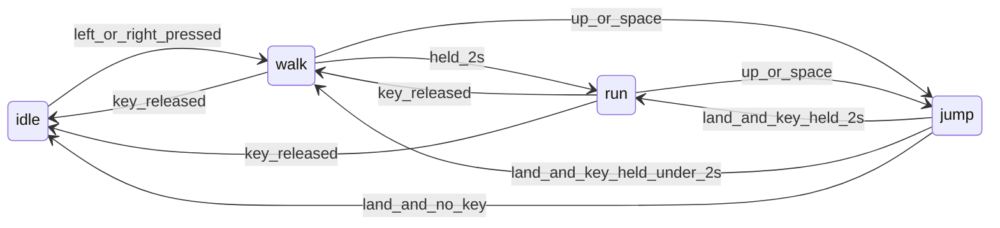

# Wizard Run State

## Current state

- Movement and animation live in [`src/game/scenes/Game.ts`](src/game/scenes/Game.ts)
- `PlayerAnimState` is `'idle' | 'walk' | 'jump'` with a state machine in `setPlayerAnimation()`
- Walk speed: `220`, jump velocity: `-420`
- [`src/game/scenes/Preloader.ts`](src/game/scenes/Preloader.ts) loads idle/walk/jump frames but **not** run frames yet
- Run assets already exist: `public/assets/wizard/3_RUN_000.png`–`3_RUN_004.png` (65×66)

## Behavior

- **Run trigger:** accumulate `moveHoldTime` with `this.game.loop.delta` while left or right is held; when `moveHoldTime >= 2000` ms, `isRunning = true`
- **Run reset:** set `moveHoldTime = 0` when neither direction key is held
- **In air (per your choice):** if direction key is still held and `moveHoldTime >= 2000`, keep `RUN_SPEED` horizontally; jump uses boosted velocity if `isRunning` at takeoff
- **Animation:** grounded + running → `wizard-run`; grounded + moving (under 2s) → `wizard-walk`; air → `wizard-jump` (unchanged)

## File changes

### 1. [`src/game/scenes/Preloader.ts`](src/game/scenes/Preloader.ts)

- In the existing `for` loop, add:
  - `this.load.image('wizard-run-${i}', 'wizard/3_RUN_${frame}.png')`
- Register animation:
  - `wizard-run`, 5 frames, `frameRate: 14`, `repeat: -1` (slightly faster than walk's 10 fps)

### 2. [`src/game/scenes/Game.ts`](src/game/scenes/Game.ts)

**New constants** (tunable defaults, ~1.5× walk):

| Constant | Value | Notes |
|----------|-------|-------|
| `RUN_HOLD_MS` | `2000` | User requirement |
| `RUN_SPEED` | `330` | 1.5× walk (`220`) |
| `RUN_JUMP_VELOCITY` | `-540` | ~1.29× walk jump (`-420`) |

**New state fields:**

- `moveHoldTime = 0`
- Extend `PlayerAnimState` with `'run'`

**`update()` logic changes:**

1. Compute `isMoving` from cursor keys
2. Update timer:
   - `isMoving` → `moveHoldTime += delta`
   - else → `moveHoldTime = 0`
3. `const isRunning = isMoving && moveHoldTime >= RUN_HOLD_MS`
4. Horizontal velocity: `const speed = isRunning ? RUN_SPEED : PLAYER_SPEED`
5. Jump on press: `const jumpVel = isRunning ? RUN_JUMP_VELOCITY : JUMP_VELOCITY`
6. Animation priority (reuse existing `inAir` debounce):
   - `inAir` → `jump`
   - `isRunning` → `run`
   - `isMoving` → `walk`
   - else → `idle`

**`setPlayerAnimation()`:** add `case 'run': this.player.anims.play('wizard-run')`

No changes needed to [`src/game/main.ts`](src/game/main.ts) or physics setup; `updatePlayerBody()` already runs on animation state change.

## Testing checklist

- Hold right < 2s → walk anim, speed 220
- Hold right ≥ 2s → run anim, speed 330
- Release key → idle, timer resets; brief re-press starts walk again from 0
- Run + jump → higher arc (`-540`), run speed maintained in air while key held
- Release key mid-air → drops to walk speed, lands in walk/idle as appropriate
- Landing flicker regression: existing `airFrames` / `groundedFrames` debounce stays untouched
