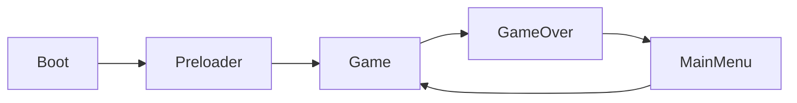
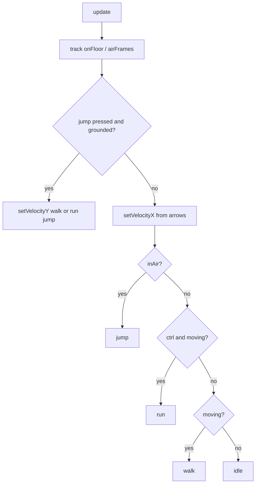

# AGENTS.md — Wizard Game Technical Reference

This document describes the **current** architecture, game logic, and conventions for the `wizard` Phaser + React project. Read this before editing game code.

## Quick summary

- **Stack:** Phaser 4, React 19, TypeScript, Vite
- **Genre:** 2D side-scrolling platformer (Arcade physics, continuous movement)
- **Main gameplay file:** `src/game/scenes/Game.ts`
- **World width:** 6480px (fixed; viewport is 1280×960)
- **Dev entry:** Preloader starts `Game` directly (skips MainMenu)

---

## Project structure

```
src/
  main.tsx                 # React bootstrap
  App.tsx                  # React UI shell + Phaser ref bridge
  PhaserGame.tsx           # Creates/destroys Phaser game, listens to EventBus
    game/
    main.ts                # Phaser Game config (resolution, physics, scene list)
    debug.ts               # Debug flags (physics, world grid)
    EventBus.ts            # Phaser Events.EventEmitter for React ↔ Phaser
    world/
      worldMap.ts          # 135×40 tile grid (0/1), platform layout
    scenes/
      Boot.ts              # Loads minimal assets, → Preloader
      Preloader.ts         # Loads game assets + registers animations
      MainMenu.ts          # Template menu (logo tween demo)
      Game.ts              # Core gameplay scene
      GameOver.ts          # Game over screen

public/assets/
  background/              # Parallax layers 1–4 (+ orig reference)
  platform/tiles/          # Platform tile images (only 11.png loaded in game)
  platform/spring_.png     # Legacy spritesheet (not used)
  wizard/                  # Character sprite frames (idle/walk/run/jump + unused attack/hurt/die)
  bg.png, logo.png, star.png
```

---

## Scene flow



| Scene      | Key          | Role |
|-----------|--------------|------|
| Boot      | `Boot`       | Loads `bg.png` for preloader splash |
| Preloader | `Preloader`  | Loads all game assets, creates animations |
| MainMenu  | `MainMenu`   | Template UI; `changeScene()` → Game |
| Game      | `Game`       | Scrolling world, platform, wizard player |
| GameOver  | `GameOver`   | Red overlay + "Game Over" text |

**Note:** `Preloader.create()` calls `this.scene.start('Game')` (dev shortcut). MainMenu is registered but not used on cold start.

Every scene that React needs to control must emit:

```ts
EventBus.emit('current-scene-ready', this);
```

at the end of `create()`.

---

## Phaser game config (`src/game/main.ts`)

| Setting | Value |
|---------|-------|
| Resolution | 1280 × 960 |
| Renderer | `AUTO` |
| Parent DOM id | `game-container` |
| Background color | `#028af8` |
| Physics | Arcade, gravity `{ x: 0, y: 800 }` |
| Physics debug | `DEBUG_PHYSICS` from `src/game/debug.ts` |

---

## Debugging

### IDE (Cursor / VS Code)

- **Run and Debug** → **Debug in Chrome** — starts Vite (`npm run dev-nolog`) and attaches the debugger
- Set breakpoints in `.ts` files under `src/`; source maps enabled in `vite/config.dev.mjs`

### In-game (dev builds only)

Flags in `src/game/debug.ts` (URL query params override defaults):

| Flag | URL param | Default (dev) | Effect |
|------|-----------|---------------|--------|
| `DEBUG_PHYSICS` | `?physicsDebug=1` | off | Arcade body outlines |
| `DEBUG_WORLD_GRID` | `?worldGrid=1` | off | World-map grid + platform cell overlay |

Set any param to `0` or `false` to disable.

**Hotkeys** (Game scene, dev only):

| Key | Action |
|-----|--------|
| `P` | Toggle physics debug |
| `G` | Toggle world grid overlay |

---

## World & camera (`Game.ts`)

| Constant | Value | Meaning |
|----------|-------|---------|
| `WORLD_WIDTH` | 6480 | World width in pixels (`135 × 48`) |
| `WORLD_HEIGHT` | 960 | World height in pixels (`40 × 24`) |
| `WORLD_MAP_COLS` | 135 | Grid columns |
| `WORLD_MAP_ROWS` | 40 | Grid rows |
| `TILE_WIDTH` | 48 | Platform tile width |
| `TILE_HEIGHT` | 24 | Platform tile height |
| `BACKGROUND_SCROLL_FACTORS` | 0.1, 0.25, 0.45, 0.65 | Parallax per bg layer |

Defined in `src/game/world/worldMap.ts`. `Game.ts` imports `WORLD_WIDTH` from there.

- `physics.world.setBounds` and `cameras.main.setBounds` match world width
- Camera follows player horizontally (`startFollow`, lerp 0.1)
- Player starts at `x: 80` on the platform surface
- `setCollideWorldBounds(true)` — player cannot leave world horizontally

---

## Platform

- **Layout:** `worldMap` in `src/game/world/worldMap.ts` — row-major `135 × 40` grid
  - `worldMap[row][col]`: `0` = empty, `1` = platform tile
  - Default: bottom row (row 39) filled with `1` (full ground)
  - Floating tiers: 7 tiers, generated in random order (`shuffleTiers`), each tier once
  - Adjacent floating tiers need at least 2 empty columns between platform runs (ground excluded)
- **Tile size:** 48×24px (`platform-tile-11`, texture used 1:1)
- **Rendering:** One static sprite per `1` cell via `physics.add.staticGroup()`
- **Position:** `tileToWorld(col, row)` — sprite origin `(0.5, 1)`, `depth 10`
- **Collider:** Same static group sprites (Arcade physics bodies)

---

## Background rendering

Four parallax `TileSprite` layers in `Game.create()`:

| Layer key | Scroll factor |
|-----------|---------------|
| `bg-layer-1` | 0.1 |
| `bg-layer-2` | 0.25 |
| `bg-layer-3` | 0.45 |
| `bg-layer-4` | 0.65 |

- Source textures: `public/assets/background/1.png`–`4.png` (576×324 each)
- `bgScale = max(viewportWidth/576, viewportHeight/324)`
- `setTileScale(bgScale)` — horizontal tiling across world width, **one row vertically** (no vertical repeat)
- No dark overlay layer (removed)

---

## Player logic (`src/game/scenes/Game.ts`)

### Movement model

**Arcade physics** with velocity-based continuous movement.

| Constant | Value |
|----------|-------|
| `PLAYER_SPEED` | 220 |
| `RUN_SPEED` | 330 |
| `JUMP_VELOCITY` | -420 |
| `RUN_JUMP_VELOCITY` | ~-438 | Run jump height = 5 rows (`√(2gh)`, gravity 800) |

Player is `physics.add.sprite` with origin `(0.5, 1)` (feet at bottom). Hitbox is narrowed via `updatePlayerBody()` (35% width, 85% height, feet-aligned).

### Controls

| Input | Action |
|-------|--------|
| Left / Right (hold) | Move horizontally |
| Ctrl + Left / Right (hold) | Run (faster speed + run animation) |
| Up or Space (press) | Jump (higher and farther if running) |

### Ground / air detection

Debounced to avoid landing flicker:

- `groundedFrames` increments while `body.onFloor()`
- `airFrames` increments while airborne
- `isGrounded` = `groundedFrames >= 1`
- `inAir` = `airFrames >= 2`
- On jump: `airFrames = 2`, `groundedFrames = 0`

### Animation state machine

`setPlayerAnimation()` only switches when state changes.

| Priority | State | Animation | Condition |
|----------|-------|-----------|-----------|
| 1 | jump | `wizard-jump` | `inAir` |
| 2 | run | `wizard-run` | grounded, Ctrl + direction held |
| 3 | walk | `wizard-walk` | grounded, direction held |
| 4 | idle | `wizard-idle` | grounded, no direction |

Run speed and boosted jump apply in air while Ctrl + direction remain held.

### Movement flow



---

## Assets & animations (`Preloader.ts`)

### Loaded textures

| Asset | Texture key |
|-------|-------------|
| `background/1–4.png` | `bg-layer-1` … `bg-layer-4` |
| `platform/tiles/11.png` | `platform-tile-11` |
| `wizard/1_IDLE_000–004.png` | `wizard-idle-0` … `4` |
| `wizard/2_WALK_000–004.png` | `wizard-walk-0` … `4` |
| `wizard/3_RUN_000–004.png` | `wizard-run-0` … `4` |
| `wizard/4_JUMP_000–004.png` | `wizard-jump-0` … `4` |

### Registered animations

| Key | Frames | FPS | Repeat |
|-----|--------|-----|--------|
| `wizard-idle` | 5 | 8 | loop |
| `wizard-walk` | 5 | 10 | loop |
| `wizard-run` | 5 | 14 | loop |
| `wizard-jump` | 5 | 12 | once |

### Wizard sprite notes

- Frames trimmed to consistent height with feet at bottom of texture
- Other assets on disk but **not loaded**: `5_ATTACK_*`, `6_HURT_*`, `7_DIE_*`
- Platform tiles `01–10`, `12–22` and `spring_.png` exist but are **not used**

---

## React bridge

### `EventBus` (`src/game/EventBus.ts`)

| Event | Direction | Payload |
|-------|-----------|---------|
| `current-scene-ready` | Phaser → React | `Phaser.Scene` instance |

### `PhaserGame.tsx`

- Creates game via `StartGame('game-container')` on mount
- Updates `ref.current = { game, scene }` when scene is ready
- Destroys game on unmount

### `App.tsx` (template demo)

- `changeScene()` — calls `MainMenu.changeScene()` → Game
- `moveSprite()` — toggles logo tween on MainMenu
- `addSprite()` — adds star sprite to active scene

---

## Documentation & AI workflow

| Artifact | Location | Committed? |
|----------|----------|------------|
| Technical reference | `AGENTS.md` | Yes |
| Cursor rule (read + sync doc) | `.cursor/rules/agents-context.mdc` | No (`.cursor/` gitignored) |
| Feature plans | `.cursor/plans/*.plan.md` | No |

**Agent workflow:**

1. Read `AGENTS.md` before changing game code
2. After meaningful implementations, update `AGENTS.md` in the same task
3. Cursor does not persist internal reasoning — use `AGENTS.md` and git history as durable context

---

## Coding conventions

1. **Import Phaser symbols** — use named imports (`Input`, `Scene`) not global `Phaser.*` at runtime
2. **Minimal diffs** — match existing style in scenes
3. **New scenes** — register in `main.ts` scene array + emit `current-scene-ready`
4. **New assets** — load in `Preloader.preload()`, animations in `Preloader.create()`
5. **Sync docs** — update `AGENTS.md` when behavior or architecture changes

---

## Known gaps / extension points

| Feature | Status |
|---------|--------|
| MainMenu on startup | Skipped; Preloader → Game directly |
| Attack / hurt / die animations | Assets on disk only |
| Extra platform tiles (01–10, 12–22) | Not loaded |
| `changeScene()` on Game | Goes to GameOver (unused in normal flow) |
| Tile/grid world system | Removed (was `src/game/world/`; no longer in codebase) |

---

## Commands

```bash
npm install
npm run dev        # http://localhost:8080
npm run build      # production build → dist/
```

---

## File priority for common tasks

| Task | Read first |
|------|------------|
| Player movement / input | `src/game/scenes/Game.ts` |
| New sprites / anims | `src/game/scenes/Preloader.ts` |
| Screen size / physics / scenes | `src/game/main.ts` |
| React integration | `src/PhaserGame.tsx`, `src/App.tsx` |
