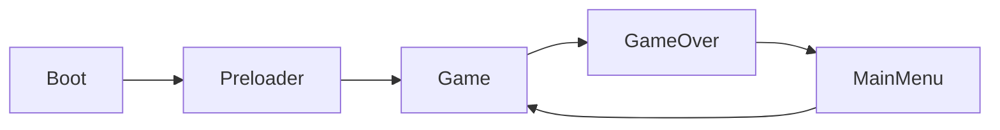
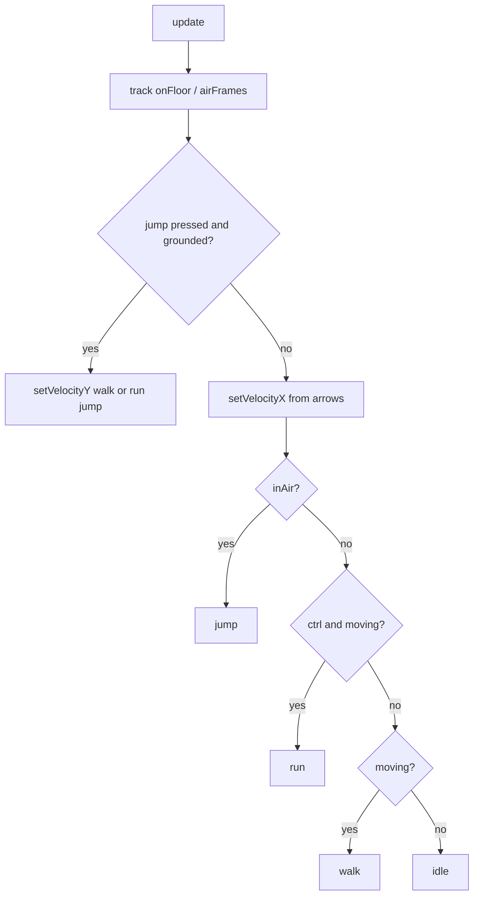

# AGENTS.md — Wizard Game Technical Reference

This document describes the **current** architecture, game logic, and conventions for the `wizard` Phaser + React project. Read this before editing game code.

## Quick summary

- **Stack:** Phaser 4, React 19, TypeScript, Vite
- **Genre:** 2D side-scrolling platformer — collect starlights before the sky goes dark
- **Main gameplay file:** `src/game/scenes/Game.ts`
- **World width:** 6480px (fixed; viewport is 1280×960)
- **Dev entry:** Preloader starts `Game` directly (skips MainMenu)

---

## Project structure

```
src/
  main.tsx                 # React bootstrap
  App.tsx                  # React UI shell + Phaser ref bridge
  PhaserGame.tsx           # Creates/destroys Phaser game, listens to EventBus
    game/
    main.ts                # Phaser Game config (resolution, physics, scene list)
    debug.ts               # Debug flags (physics, world grid)
    EventBus.ts            # Phaser Events.EventEmitter for React ↔ Phaser
    world/
      worldMap.ts          # 135×40 tile grid (0/1), platform layout
      platformLayer.ts     # Batched TilemapLayer from world grid + collision
      starlightSpawns.ts   # Starlight spawn positions from platform runs
      gloomMiteSpawns.ts   # Gloom mite spawn positions from platform runs
    starlightConfig.ts     # Darkness timer + starlight placement tuning
    starlightAnimations.ts # Starlight idle + collect tweens
    baddiesConfig.ts       # Gloom mite patrol, hit, and spawn tuning
    scenes/
      Boot.ts              # Loads minimal assets, → Preloader
      Preloader.ts         # Loads game assets + registers animations
      MainMenu.ts          # Template menu (logo tween demo)
      Game.ts              # Core gameplay scene
      GameOver.ts          # Game over screen

public/assets/
  background/              # Parallax layers 1–4 (+ orig reference)
  platform/tiles/          # Platform tile images (only 11.png loaded in game)
  platform/spring_.png     # Legacy spritesheet (not used)
  wizard/                  # Character spritesheet + source frames (attack/die unused)
  bg.png, logo.png, star.png
  starlight/               # Starlight collectible (stars.png, 48×48)
```

---

## Scene flow



| Scene      | Key          | Role |
|-----------|--------------|------|
| Boot      | `Boot`       | Loads `bg.png` for preloader splash |
| Preloader | `Preloader`  | Loads all game assets, creates animations |
| MainMenu  | `MainMenu`   | Template UI; `changeScene()` → Game |
| Game      | `Game`       | Scrolling world, platform, wizard player |
| GameOver  | `GameOver`   | Red overlay + "Game Over" text |

**Note:** `Preloader.create()` calls `this.scene.start('Game')` (dev shortcut). MainMenu is registered but not used on cold start.

Every scene that React needs to control must emit:

```ts
EventBus.emit('current-scene-ready', this);
```

at the end of `create()`.

---

## Phaser game config (`src/game/main.ts`)

| Setting | Value |
|---------|-------|
| Resolution | 1280 × 960 |
| Renderer | `AUTO` |
| Render | `antialias: true`, `pixelArt: false` |
| Scale | `FIT`, `CENTER_BOTH` |
| Parent DOM id | `game-container` |
| Background color | `#028af8` |
| Physics | Arcade, gravity `{ x: 0, y: 800 }` |
| Physics debug | `DEBUG_PHYSICS` from `src/game/debug.ts` |

---

## Debugging

### IDE (Cursor / VS Code)

- **Run and Debug** → **Debug in Chrome** — starts Vite (`npm run dev-nolog`) and attaches the debugger
- Set breakpoints in `.ts` files under `src/`; source maps enabled in `vite/config.dev.mjs`

### In-game (dev builds only)

Flags in `src/game/debug.ts` (URL query params override defaults):

| Flag | URL param | Default (dev) | Effect |
|------|-----------|---------------|--------|
| `DEBUG_PHYSICS` | `?physicsDebug=1` | off | Arcade body outlines |
| `DEBUG_WORLD_GRID` | `?worldGrid=1` | off | World-map grid + platform cell overlay |

Set any param to `0` or `false` to disable.

**Hotkeys** (Game scene, dev only):

| Key | Action |
|-----|--------|
| `P` | Toggle physics debug |
| `G` | Toggle world grid overlay |

---

## World & camera (`Game.ts`)

| Constant | Value | Meaning |
|----------|-------|---------|
| `WORLD_WIDTH` | 6480 | World width in pixels (`135 × 48`) |
| `WORLD_HEIGHT` | 960 | World height in pixels (`40 × 24`) |
| `WORLD_MAP_COLS` | 135 | Grid columns |
| `WORLD_MAP_ROWS` | 40 | Grid rows |
| `TILE_WIDTH` | 48 | Platform tile width |
| `TILE_HEIGHT` | 24 | Platform tile height |
| `BACKGROUND_SCROLL_FACTORS` | 0.1, 0.25, 0.45, 0.65 | Parallax per bg layer |

Defined in `src/game/world/worldMap.ts`. `Game.ts` imports `WORLD_WIDTH` from there.

- `physics.world.setBounds` and `cameras.main.setBounds` match world width
- Camera follows player horizontally (`startFollow`, lerp `1` on X — locked to player)
- `cameras.main.roundPixels = false` — subpixel scroll for smoother motion with filtered sprites
- Player starts at `x: 80` on the platform surface
- `setCollideWorldBounds(true)` — player cannot leave world horizontally

---

## Platform

- **Layout:** `worldMap` in `src/game/world/worldMap.ts` — row-major `135 × 40` grid
 - `worldMap[row][col]`: `0` = empty, `1` = platform tile, `2` = tree1, `4` = tree2 (air row above platform)
 - Bottom row (row 39) filled with `1` (full ground)
 - Floating platforms are built as **connected climbable structures** (towers/staircases), not scattered segments
- **Tile size:** 48×24px (`platform-tile-11`, texture used 1:1)
- **Rendering:** single batched `TilemapLayer` via `createPlatformLayer()` in `platformLayer.ts` (cell `1` tiles); tree sprites for cell `2`/`4` in the row above, feet on `tileSurfaceY(platformRow)`
- **Collision:** arcade collider on the tilemap layer (tile index `0`); trees are decorative

### Generation (`createDefaultWorldMap`)

Structures are placed left→right across the world, separated by `MIN_STRUCTURE_GAP`–`MAX_STRUCTURE_GAP` empty columns (ground connects them).

| Constant | Value | Meaning |
|----------|-------|---------|
| `TIER_ROW_STEP` | 4 | Rows between stacked tiers (96px < walk-jump apex ~120px) |
| `MAX_STRUCTURE_TIERS` | 6 | Tallest staircase (in tiers); kept low to limit tile count |
| `MIN_RUN_LENGTH` / `MAX_RUN_LENGTH` | 3 / 5 | Platform run length bounds (≥3 ⇒ can host a starlight) |
| `MIN_STEP_GAP` / `MAX_STEP_GAP` | 2 / 3 | Empty cols between stacked tiers — the jump room |
| `MIN_STRUCTURE_GAP` / `MAX_STRUCTURE_GAP` | 6 / 14 | Empty columns between structures |

- `buildStructure()` builds an **up-and-over staircase**: each step goes up one tier *and* right by an empty `STEP_GAP`. A tier never sits directly over the one below, so the wizard always has clear sky to launch through and a side approach to land on — no unjumpable overhang. The gap (2–3 cols) is tuned to the wall-clearance math: ≥2 cols clears the platform's edge while rising 96px, ≤3 still lands on the upper run.
- Tier 1 is reachable from the continuous ground; each higher step is reachable from the step below ⇒ the whole staircase is climbable.
- Typical output: ~12–18 starlights, ~40–70 floating tiles per generation.

### Reachability guarantee

`worldMap.ts` runs a BFS (`computeReachableRuns`) from the ground run over a **conservative walk-jump model**, then `pruneUnreachableRuns()` clears any platform run not reachable. Because starlights/mites only spawn on surviving runs, **every starlight is guaranteed collectible**.

| Constant | Value | Meaning |
|----------|-------|---------|
| `MAX_JUMP_UP_ROWS` | 4 | Max rows climbed in one jump |
| `MAX_GAP_FOR_RISE` | `[5,4,4,3,3]` | Max horizontal gap (cols) clearable per rise (rows) |
| `MAX_DROP_GAP` | 6 | Max horizontal gap when dropping/level |

To extend jump physics in `Game.ts`, keep these bounds in sync (or more conservative) so the BFS never accepts a jump the player can't make.

### Decorative trees (cell `2`)

| Constant | Value | Meaning |
|----------|-------|---------|
| `TREE_COUNT` | 4 | Trees placed per world |
| `CELL_TREE` | 2 | Tree type 1 (`tree1.png`) in air row above platform |
| `CELL_TREE_2` | 4 | Tree type 2 (`tree2.png`) in air row above platform |
| Tree width | 2×–4× `TILE_WIDTH` | Stored in `worldTreeScale[treeRow][col]` |

- **Sprites:** `tree1.png` → `tree-1`, `tree2.png` → `tree-2` (sources downscaled to **256px** long edge)
- **Grid layout:** tree cell at row `R`, platform at row `R + 1` (same `col`)
- **Placement:** 4 trees total — at least 1 on ground, spread evenly left→right across the world (not clustered at the start); no overlapping footprints
- **Rendering:** `getTreeTextureKey(cell)`; feet at `tileSurfaceY(platformRow)`

---

## Starlights & darkness

**Goal:** Collect all starlights before the sky becomes fully dark.

| Constant | Value | Meaning |
|----------|-------|---------|
| `DARKNESS_FILL_SECONDS` | 90 | Time until sky is 100% dark if no starlights collected |
| `STARLIGHT_GROUND_OFFSET` | 18 | Walk-through height above platform surface |
| `STARLIGHT_JUMP_OFFSET` | 54 | Standing-jump height — must leave the ground |
| `STARLIGHT_ARC_OFFSET` | 42 | Run-jump height — paired with horizontal offset |
| `STARLIGHT_DISPLAY_SIZE` | 24 | On-screen starlight sprite size (one tile height) |
| `STARLIGHT_PULSE_SCALE` | 1.12 | Idle pulse tween peak scale |
| `STARLIGHT_PULSE_MS` | 700 | Pulse half-cycle duration |
| `STARLIGHT_TWINKLE_ALPHA_MIN` | 0.82 | Minimum alpha during twinkle |
| `STARLIGHT_TWINKLE_MS` | 900 | Twinkle half-cycle duration |
| `STARLIGHT_COLLECT_MS` | 280 | Collect burst duration |

- **Sprite:** `public/assets/starlight/stars.png` (texture key `starlight`, source **48×48**; displayed at 24px)
- **Idle motion:** `setupStarlightIdleAnimations()` in `starlightAnimations.ts` — **pulse + twinkle** tweens per starlight (staggered by spawn position; two tweens each)
- **Collect burst:** `playStarlightCollectAnimation()` — scale up, spin, fade out before the sprite is removed
- **Spawns:** One starlight per platform run (length ≥ 3) via `getStarlightSpawns(worldMap)`. Placement is deterministic per run (`runSeed`):
  - **ground** (~40%): center of run, low — walk through to collect
  - **jump** (~35%): center, higher — standing jump required
  - **arc** (~25%, runs ≥ 4 only): near run start/end, mid height — run and jump to collect
- **Collection:** `physics.add.overlap` with player; each starlight pushes darkness back by `1 / totalStarlights`
- **HUD:** Top-left — `Starlights: collected/total` + sky darkness %. `updateHud()` only runs when displayed values change (sky % ticks ~1/s; starlight count on collect/hit). Darkness overlay alpha still updates every frame.
- **Overlay:** Full-screen `darknessOverlay` (scroll factor 0, depth 30), alpha tracks darkness
- **Win:** All starlights collected → `GameOver` with `outcome: 'victory'`
- **Lose:** Darkness reaches 100% → `GameOver` with `outcome: 'darkness'`

---

## Gloom mites (baddies)

Patrol enemies on floating platform runs; contact adds darkness (no HP system).

| Constant | Value | Meaning |
|----------|-------|---------|
| `GLOOM_MITE_DARKNESS_SPIKE` | 0.08 | Darkness added per hit (8%) |
| `GLOOM_MITE_PATROL_SPEED` | 80 | Horizontal patrol speed (px/s) |
| `GLOOM_MITE_DISPLAY_SIZE` | 32 | On-screen sprite size |
| `GLOOM_MITE_HIT_COOLDOWN_MS` | 1200 | Invulnerability between hits |
| `GLOOM_MITE_KNOCKBACK_X` | 180 | Horizontal knockback on hit |
| `MIN_GLOOM_MITE_RUN_LENGTH` | 4 | Minimum platform run length to spawn |

- **Sprite:** Procedural texture `gloom-mite` in `Preloader.createGloomMiteTexture()`
- **When:** All mites spawn at level start in `Game.spawnGloomMites()` (not time-gated)
- **Where:** One per platform run (length ≥ 4) on floating tiers only (ground row excluded) via `getGloomMiteSpawns(worldMap)`
- **Behavior:** Patrol between run edges; platform collider; flip at bounds
- **On hit:** Darkness spike, knockback, `wizard-hurt` animation, brief purple tint
- **Depth:** 18 (above platforms, below player)

---

## Background rendering

Four parallax `TileSprite` layers in `Game.create()`:

| Layer key | Scroll factor |
|-----------|---------------|
| `bg-layer-1` | 0.1 |
| `bg-layer-2` | 0.25 |
| `bg-layer-3` | 0.45 |
| `bg-layer-4` | 0.65 |

- Source textures: `public/assets/background/1.png`–`4.png` (576×324 each)
- `bgScale = max(viewportWidth/576, viewportHeight/324)`
- `setTileScale(bgScale)` — horizontal tiling across world width, **one row vertically** (no vertical repeat)
- No dark overlay layer (removed)

---

## Player logic (`src/game/scenes/Game.ts`)

### Movement model

**Arcade physics** with velocity-based continuous movement.

| Constant | Value |
|----------|-------|
| `PLAYER_SPEED` | 240 |
| `RUN_SPEED` | 360 |
| `PLAYER_DRAG_X` | 1400 | Horizontal drag — coast to stop when keys released |
| `JUMP_VELOCITY` | ~-438 | Walk jump height = `WALK_JUMP_ROWS` = 5 rows (`√(2gh)`, gravity 800) |
| `RUN_JUMP_VELOCITY` | ~-480 | Run jump height = `RUN_JUMP_ROWS` = 6 rows |

Jump heights are derived from row counts (`WALK_JUMP_ROWS` / `RUN_JUMP_ROWS`), so they stay clearly above the 4-row tier step and keep the world-map reachability model valid.

Player is `physics.add.sprite` with origin `(0.5, 1)` (feet at bottom). Hitbox is narrowed via `updatePlayerBody()` (35% width, 85% height, feet-aligned). `setDragX(PLAYER_DRAG_X)` — releasing movement keys no longer zeroes velocity instantly; the wizard coasts to a stop on the ground.

### Controls

| Input | Action |
|-------|--------|
| Left / Right (hold) | Move horizontally |
| Ctrl + Left / Right (hold) | Run (faster speed + run animation) |
| Up or Space (press) | Jump (higher and farther if running) |

### Ground / air detection

Debounced to avoid landing flicker:

- `groundedFrames` increments while `body.onFloor()`
- `airFrames` increments while airborne
- `isGrounded` = `groundedFrames >= 1`
- `inAir` = `airFrames >= 2`
- On jump: `airFrames = 2`, `groundedFrames = 0`

### Animation state machine

`setPlayerAnimation()` only switches when state changes.

| Priority | State | Animation | Condition |
|----------|-------|-----------|-----------|
| 1 | hurt | `wizard-hurt` | gloom mite hit — locks until animation completes |
| 2 | jump | `wizard-jump` | `inAir` |
| 3 | run | `wizard-run` | grounded, Shift + direction held |
| 4 | walk | `wizard-walk` | grounded, direction held or coasting (`|velocityX| > 8`) |
| 5 | idle | `wizard-idle` | grounded, no input and not coasting |

Run speed and boosted jump apply in air while Ctrl + direction remain held.

### Movement flow



---

## Assets & animations (`Preloader.ts`)

### Loaded textures

| Asset | Texture key |
|-------|-------------|
| `background/1–4.png` | `bg-layer-1` … `bg-layer-4` |
| `platform/tiles/11.png` | `platform-tile-11` |
| `starlight/stars.png` | `starlight` |
| `platform/elements/tree1.png` | `tree-1` |
| `platform/elements/tree2.png` | `tree-2` |
| `wizard/wizard-sheet.png` | `wizard` (spritesheet, 72×76 cells) |

### Registered animations

| Key | Sheet frames | FPS | Repeat |
|-----|--------------|-----|--------|
| `wizard-idle` | 0–4 | 8 | loop |
| `wizard-walk` | 5–9 | 10 | loop |
| `wizard-run` | 10–14 | 14 | loop |
| `wizard-jump` | 15–19 | 12 | once |
| `wizard-hurt` | 20–24 | 14 | once |

### Wizard sprite notes

- Single spritesheet `wizard-sheet.png` (360×380, 5×5 grid of 72×76 cells); source PNGs in `wizard/` kept for editing
- Frames bottom-aligned in cells; feet at bottom of each cell (player origin `(0.5, 1)`)
- Other assets on disk but **not loaded**: `5_ATTACK_*`, `7_DIE_*`
- Platform tiles `01–10`, `12–22` and `spring_.png` exist but are **not used**

---

## React bridge

### `EventBus` (`src/game/EventBus.ts`)

| Event | Direction | Payload |
|-------|-----------|---------|
| `current-scene-ready` | Phaser → React | `Phaser.Scene` instance |

### `PhaserGame.tsx`

- Creates game via `StartGame('game-container')` on mount
- Updates `ref.current = { game, scene }` when scene is ready
- Destroys game on unmount

### `App.tsx` (template demo)

- `changeScene()` — calls `MainMenu.changeScene()` → Game
- `moveSprite()` — toggles logo tween on MainMenu
- `addSprite()` — adds star sprite to active scene

---

## Documentation & AI workflow

| Artifact | Location | Committed? |
|----------|----------|------------|
| Technical reference | `AGENTS.md` | Yes |
| Cursor rule (read + sync doc) | `.cursor/rules/agents-context.mdc` | No (`.cursor/` gitignored) |
| Feature plans | `.cursor/plans/*.plan.md` | No |

**Agent workflow:**

1. Read `AGENTS.md` before changing game code
2. After meaningful implementations, update `AGENTS.md` in the same task
3. Cursor does not persist internal reasoning — use `AGENTS.md` and git history as durable context

---

## Coding conventions

1. **Import Phaser symbols** — use named imports (`Input`, `Scene`) not global `Phaser.*` at runtime
2. **Minimal diffs** — match existing style in scenes
3. **New scenes** — register in `main.ts` scene array + emit `current-scene-ready`
4. **New assets** — load in `Preloader.preload()`, animations in `Preloader.create()`
5. **Sync docs** — update `AGENTS.md` when behavior or architecture changes

---

## Known gaps / extension points

| Feature | Status |
|---------|--------|
| MainMenu on startup | Skipped; Preloader → Game directly |
| Attack / die animations | Assets on disk only |
| Extra platform tiles (01–10, 12–22) | Not loaded |
| `changeScene()` on Game | Goes to GameOver (unused in normal flow) |
| Tile/grid world system | Removed (was `src/game/world/`; no longer in codebase) |

---

## Commands

```bash
npm install
npm run dev        # http://localhost:8080
npm run build      # production build → dist/
```

---

## File priority for common tasks

| Task | Read first |
|------|------------|
| Player movement / input | `src/game/scenes/Game.ts` |
| New sprites / anims | `src/game/scenes/Preloader.ts` |
| Screen size / physics / scenes | `src/game/main.ts` |
| React integration | `src/PhaserGame.tsx`, `src/App.tsx` |
